# ByteBuf Lifecycle Flow Diagrams

## Diagram 1: Overall ByteBuf Flow (Unencrypted Path)


## Diagram 2: Encrypted Path ByteBuf Flow


## Diagram 3: Error/Abort Path - releaseChunksOnCompletion


## Diagram 4: Thread Interaction and Lock Hierarchy


## Diagram 5: ByteBuf Retention Points (Reference Count Changes)

```mermaid
graph TD
    Start([ByteBuf Created by Channel<br/>refcount = 1]) --> R1

    R1[RETAIN +1<br/>fillFrom:1668<br/>readRetainedSlice<br/>refcount = 2] --> R2

    R2[RELEASE -1<br/>resolveOldestChunk<br/>Channel releases<br/>refcount = 1] --> Decision1{Path?}

    Decision1 -->|Compression| Comp
    Decision1 -->|No Compression| NoComp
    Decision1 -->|Encryption| Enc

    subgraph Compression[Compression Path]
        Comp[RELEASE -1<br/>compressChunk:1581<br/>buf.release<br/>refcount = 0]
        Comp --> CompNew[New compressed buffer<br/>refcount = 1]
    end

    subgraph Encryption[Encryption Path]
        Enc[RETAIN +1<br/>encryptChunk:1607<br/>retainedDuplicate<br/>refcount = 2]
        Enc --> EncJob[EncryptJob processes]
        EncJob --> EncRel1[RELEASE -1<br/>encryptionCallback:1510<br/>original released<br/>refcount = 1]
        EncRel1 --> EncRel2[RELEASE -1<br/>EncryptJob releases copy<br/>refcount = 0]
        EncRel2 --> EncNew[New encrypted buffer<br/>refcount = 1]
    end

    NoComp --> Final
    CompNew --> Final
    EncNew --> Final

    subgraph Network[Network Send]
        Final[RETAIN +1<br/>createPutRequest:1879<br/>retainedDuplicate<br/>refcount = 2]
        Final --> NetSend[PutRequest owns copy]
        NetSend --> NetRel[RELEASE -1<br/>PutRequest.release<br/>refcount = 1]
    end

    NetRel --> Cleanup

    subgraph Cleanup[Cleanup]
        Cleanup[RELEASE -1<br/>clear → releaseBlobContent:1262<br/>safeRelease<br/>refcount = 0]
    end

    Cleanup --> End([ByteBuf Freed])

    style R1 fill:#ff9999
    style Enc fill:#ff9999
    style Final fill:#ff9999
    style R2 fill:#99ff99
    style Comp fill:#99ff99
    style EncRel1 fill:#99ff99
    style EncRel2 fill:#99ff99
    style NetRel fill:#99ff99
    style Cleanup fill:#99ff99
    style End fill:#ffff99
```

## Diagram 6: The Race Condition - Timeline View

```mermaid
sequenceDiagram
    participant CF as ChunkFiller Thread
    participant Chunk as PutChunk
    participant Main as Response Thread

    Note over CF: fillFrom() - NO LOCK ⚠️
    CF->>Chunk: Read: if (buf == null)?
    Chunk-->>CF: false (buf exists)
    CF->>Chunk: Read: buf.readableBytes()

    Note over Main: Error received
    Main->>Main: setOperationCompleted()
    Main->>Main: releaseChunksOnCompletion()<br/>[PutOperation Lock]
    Main->>Chunk: releaseBlobContent()<br/>[PutChunk Lock]
    Chunk->>Chunk: ReferenceCountUtil.safeRelease(buf)
    Note over Chunk: ByteBuf FREED to pool
    Chunk->>Chunk: buf = null

    CF->>Chunk: Access: buf instanceof CompositeByteBuf?
    Note over CF: 💀 NullPointerException<br/>OR Use-After-Free

    rect rgb(255, 200, 200)
        Note over CF,Main: CRITICAL BUG:<br/>fillFrom has NO LOCK,<br/>can't prevent concurrent release
    end
```



## Diagram 7: State Transition and ByteBuf Ownership

```mermaid
stateDiagram-v2
    [*] --> Free: Chunk created

    Free --> Building: prepareForBuilding()<br/>buf = null

    Building --> Building: fillFrom()<br/>RETAIN slices<br/>buf = CompositeByteBuf

    Building --> AwaitingBlobTypeResolution: First chunk full<br/>buf has data

    Building --> Ready: onFillComplete()<br/>(no encryption)<br/>buf may be compressed

    Building --> Encrypting: onFillComplete()<br/>(encryption enabled)<br/>RETAIN copy for job

    AwaitingBlobTypeResolution --> Ready: maybeResolveAwaitingChunk()<br/>(no encryption)

    AwaitingBlobTypeResolution --> Encrypting: maybeResolveAwaitingChunk()<br/>(encryption enabled)

    Encrypting --> Ready: encryptionCallback()<br/>RELEASE original<br/>buf = encrypted

    Ready --> Complete: handleResponse()<br/>All replicas succeed<br/>buf unchanged

    Complete --> Free: clear()<br/>RELEASE buf<br/>buf = null

    Building --> Free: ERROR<br/>releaseBlobContent()
    Encrypting --> Free: ERROR<br/>(encryption thread releases)
    Ready --> Free: ERROR<br/>releaseBlobContent()
    Complete --> Free: ERROR<br/>releaseBlobContent()

    note right of Free
        buf = null
        No ownership
    end note

    note right of Building
        buf = retained slices
        ChunkFiller owns
        ⚠️ fillFrom() NO LOCK!
    end note

    note right of Encrypting
        original buf released
        EncryptJob owns copy
        State SKIPPED by
        releaseChunksOnCompletion
    end note

    note right of Ready
        buf = final buffer
        (compressed/encrypted)
        PutChunk owns
        Can be released by:
        - Main thread (clear)
        - Any thread (abort)
    end note

    note right of Complete
        buf = final buffer
        PutChunk owns
        Waiting for clear()
    end note
```



## Diagram 8: Deadlock Scenario (Why sync was removed)

```mermaid
sequenceDiagram
    participant CF as ChunkFiller Thread
    participant Chunk as PutChunk
    participant Op as PutOperation
    participant Resp as Response Thread

    Note over CF: If fillFrom() WAS synchronized...

    CF->>Chunk: fillFrom() [ACQUIRE PutChunk Lock]
    activate Chunk
    CF->>Chunk: fillFrom processing...
    CF->>Chunk: onFillComplete()
    CF->>Chunk: encryptChunk()
    Note over Chunk: Exception in encryptChunk!
    CF->>Op: setOperationExceptionAndComplete()<br/>[NEED PutOperation Lock]

    par Concurrent Error
        Resp->>Op: handleResponse error<br/>[ACQUIRE PutOperation Lock]
        activate Op
        Resp->>Op: setOperationCompleted()
        Resp->>Op: releaseChunksOnCompletion()
        Resp->>Chunk: releaseBlobContent()<br/>[NEED PutChunk Lock]
    end

    rect rgb(255, 200, 200)
        Note over CF,Resp: DEADLOCK!<br/>CF: PutChunk → needs PutOperation<br/>Resp: PutOperation → needs PutChunk
    end

    Note over CF,Resp: Author's "Fix": Remove sync from fillFrom()<br/>Result: Deadlock avoided, USE-AFTER-FREE introduced!
```



## Legend

- 🔴 Red boxes: RETAIN operations (refcount +1)
- 🟢 Green boxes: RELEASE operations (refcount -1)
- 🟡 Yellow boxes: ByteBuf freed (refcount = 0)
- ⚠️ Warning symbol: Synchronization issue
- 💀 Skull symbol: Critical bug (use-after-free)
- 🔒 Lock symbol: Synchronized method

## Key Insights

1. **ByteBuf lifecycle spans multiple threads**: ChunkFiller, Encryption, Main, and Channel callback threads all interact with the same ByteBuf reference.

2. **Reference counting is critical**: Each `retainedSlice()` and `retainedDuplicate()` must have a corresponding `release()`.

3. **State transitions determine ownership**:
   - `Building`: ChunkFiller owns
   - `Encrypting`: EncryptJob owns (releaseChunksOnCompletion skips)
   - `Ready`/`Complete`: PutChunk owns (can be released by multiple threads)

4. **The commit introduces a critical race**: Removing `synchronized` from `fillFrom()` allows concurrent access to `buf` while it's being freed.

5. **Lock hierarchy problem**: The code has a natural deadlock between PutOperation lock and PutChunk lock, which is why the author removed synchronization - but this trades a detectable deadlock for a silent use-after-free bug.

6. **Multiple release paths**: The same buffer can potentially be released by:
   - ChunkFiller thread (error during fill)
   - Encryption thread (callback)
   - Main thread (clear after success)
   - Any thread (releaseChunksOnCompletion on abort)

7. **Channel queue is separate**: `chunkFillerChannel.close()` releases queued ByteBufs that were never consumed - this is correct and necessary.
