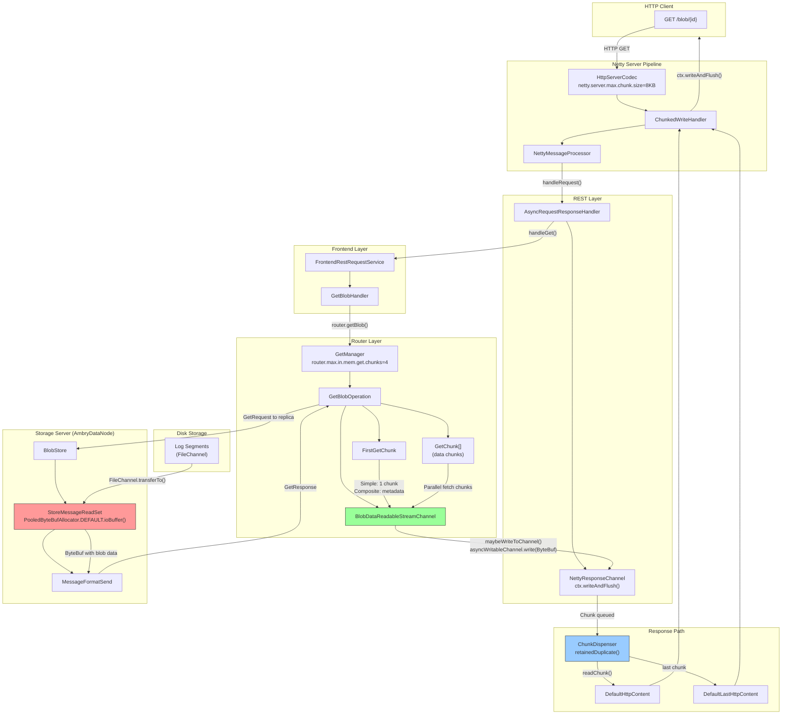
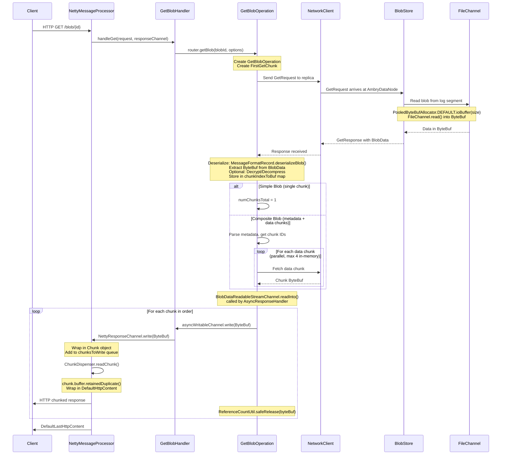

# Ambry GET Request Flow and Netty Buffer Analysis

## Understanding `io.netty.allocator.maxOrder`

### What is `maxOrder`?

The JVM system property `io.netty.allocator.maxOrder` controls the maximum size of pooled buffer allocations in Netty's `PooledByteBufAllocator`. The formula is:

```
maxChunkSize = pageSize × 2^maxOrder
```

Where:
- **pageSize** defaults to 8KB (8,192 bytes)
- **maxOrder** defaults to 11

| maxOrder | Max Pooled Buffer Size |
|----------|------------------------|
| 9        | 8KB × 2^9 = **4 MB**   |
| 10       | 8KB × 2^10 = **8 MB**  |
| 11       | 8KB × 2^11 = **16 MB** (default) |
| 12       | 8KB × 2^12 = **32 MB** |
| 13       | 8KB × 2^13 = **64 MB** |

**Critical**: Allocations exceeding `maxChunkSize` fall back to **unpooled (direct) allocations**, which are slower and not recycled.

---

## GET Request Flow Diagram



---

## Detailed Data Flow: Disk to HTTP Response



---

## Where ByteBuf Allocations Occur

### 1. Storage Layer (Reading from Disk)
**File**: `ambry-store/src/main/java/com/github/ambry/store/StoreMessageReadSet.java:172`

```java
void doPrefetch(long relativeOffset, long size) throws IOException {
    prefetchedData = PooledByteBufAllocator.DEFAULT.ioBuffer((int) sizeToRead);
    // FileChannel.read() into prefetchedData
}
```

**Impact of maxOrder**:
- If blob chunk size > `pageSize × 2^maxOrder`, this allocation bypasses the pool
- Unpooled allocations are slower and may cause memory fragmentation

### 2. Protocol Layer (Building Responses)
**File**: `ambry-protocol/src/main/java/com/github/ambry/protocol/GetResponse.java:131`

```java
bufferToSend = PooledByteBufAllocator.DEFAULT.ioBuffer(headerSize);
CompositeByteBuf compositeByteBuf = bufferToSend.alloc().compositeDirectBuffer();
compositeByteBuf.addComponent(true, bufferToSend);
compositeByteBuf.addComponent(true, toSendContent);  // Zero-copy add
```

### 3. Response Channel (Writing to Netty)
**File**: `ambry-rest/src/main/java/com/github/ambry/rest/NettyResponseChannel.java:156-158`

```java
public Future<Long> write(ByteBuffer src, Callback<Long> callback) {
    write(Unpooled.wrappedBuffer(src), callback);  // Zero-copy wrap!
}
```

**Key**: Uses `Unpooled.wrappedBuffer()` - this does NOT allocate new memory, just wraps the existing ByteBuffer.

### 4. ChunkDispenser (Final HTTP Output)
**File**: `ambry-rest/src/main/java/com/github/ambry/rest/NettyResponseChannel.java:1016-1019`

```java
if (chunk.isLast) {
    content = new DefaultLastHttpContent(chunk.buffer.retainedDuplicate());
} else {
    content = new DefaultHttpContent(chunk.buffer.retainedDuplicate());
}
```

**Key**: Uses `retainedDuplicate()` - zero-copy, just increments reference count.

---

## Ambry Configuration vs Netty maxOrder Interaction

### Key Ambry Configuration Properties

| Property | Default | Description |
|----------|---------|-------------|
| `router.max.put.chunk.size.bytes` | **4 MB** | Maximum size of each chunk when splitting large blobs |
| `router.max.in.mem.get.chunks` | **4** | Max chunks buffered in memory during GET |
| `netty.server.max.chunk.size` | **8 KB** | HTTP codec chunk size (not related to blob chunks) |
| `netty.server.request.buffer.watermark` | **32 MB** | Flow control threshold for buffered data |

### Memory Usage Analysis

For a GET operation on a **100 MB blob**:

```
Scenario: 100MB blob with 4MB chunks = 25 chunks

With routerMaxInMemGetChunks = 4:
  Max memory at any time = 4 × 4MB = 16MB per GET operation

With maxOrder = 11 (default, 16MB max pooled):
  ✓ All 4MB chunk allocations use pooled buffers
  ✓ Efficient memory recycling

With maxOrder = 9 (4MB max pooled):
  ✓ 4MB chunks exactly fit in pool
  ⚠ Any overhead may cause unpooled fallback

With maxOrder = 8 (2MB max pooled):
  ✗ All 4MB chunk allocations are UNPOOLED
  ✗ Direct memory allocations, no recycling
  ✗ Potential memory fragmentation and GC pressure
```

### Simple Blobs vs Composite Blobs

**Simple Blobs** (size ≤ `router.max.put.chunk.size.bytes`):
- Single allocation for entire blob content
- Size can be up to 4MB by default
- Always fits in default pooled allocator (16MB max)

**Composite Blobs** (size > `router.max.put.chunk.size.bytes`):
- Split into chunks at PUT time
- Each chunk ≤ 4MB
- Chunks fetched in parallel, limited by `router.max.in.mem.get.chunks`

---

## Performance Impact of maxOrder Changes

### Lowering maxOrder (e.g., from 11 to 9)

**Pros**:
- Reduced per-arena memory overhead
- Lower memory footprint for idle connections
- Potentially lower startup memory

**Cons**:
- Allocations > 4MB become unpooled
- If Ambry chunk sizes exceed new limit:
  - More frequent native memory allocations
  - No buffer recycling for large chunks
  - Potential memory fragmentation
  - Higher GC pressure (for cleanup of direct buffers)

### Raising maxOrder (e.g., from 11 to 13)

**Pros**:
- Larger allocations stay pooled (up to 64MB)
- Better recycling for large blobs

**Cons**:
- Higher baseline memory usage per arena
- May waste memory if large allocations are rare

---

## Optimization Recommendations

### 1. Ensure maxOrder Accommodates Chunk Size

```bash
# Current Ambry default: 4MB chunks
# Recommended minimum maxOrder:
#   4MB = 8KB × 2^9 → maxOrder ≥ 9

# Safe value that allows headroom:
-Dio.netty.allocator.maxOrder=11  # 16MB max (default, recommended)
```

### 2. Tune Chunk Sizes Together

If reducing `maxOrder`, also reduce `router.max.put.chunk.size.bytes`:

```properties
# For maxOrder = 9 (4MB max):
router.max.put.chunk.size.bytes = 4194304  # 4MB exactly

# For maxOrder = 8 (2MB max):
router.max.put.chunk.size.bytes = 2097152  # 2MB
```

### 3. Monitor Unpooled Allocations

Use Netty metrics to monitor allocation patterns:

```java
// Ambry already collects these in NettyInternalMetrics.java:192
PooledByteBufAllocatorMetric metric = PooledByteBufAllocator.DEFAULT.metric();
// Check: numDirectArenas, usedDirectMemory, numAllocations
```

### 4. Consider Workload Characteristics

| Workload | Recommended maxOrder | Rationale |
|----------|---------------------|-----------|
| Small blobs (< 1MB) | 9 | Lower memory footprint |
| Mixed (1-10MB) | 11 | Balance memory and pooling |
| Large blobs (> 10MB) | 12-13 | Maximize pooling efficiency |

---

## Zero-Copy Optimization Points

Ambry uses several zero-copy techniques that are **independent of maxOrder**:

1. **FileChannel.transferTo()**: Direct kernel-to-socket transfer (when not prefetching)
   - Location: `StoreMessageReadSet.java:230`

2. **Unpooled.wrappedBuffer()**: Wraps existing ByteBuffer without copying
   - Location: `NettyResponseChannel.java:158`

3. **CompositeByteBuf**: Aggregates multiple buffers without copying
   - Location: `GetResponse.java:147`

4. **retainedDuplicate()**: Shares buffer with reference counting
   - Location: `NettyResponseChannel.java:1016`

These optimizations reduce the impact of allocation performance on overall throughput.

---

## Summary

| Aspect | How maxOrder Affects Ambry |
|--------|---------------------------|
| **Chunk Storage Read** | Allocations > pageSize×2^maxOrder bypass pool |
| **Memory Recycling** | Larger maxOrder = more reusable large buffers |
| **Memory Footprint** | Larger maxOrder = higher baseline memory per arena |
| **Optimal Setting** | maxOrder ≥ 9 for default 4MB chunks; 11 recommended |
| **Ambry Config Sync** | `router.max.put.chunk.size.bytes` should fit within maxOrder limit |

**Key Insight**: Ambry's default chunk size (4MB) is well within Netty's default maxOrder (11 = 16MB max), so **no configuration changes are needed for typical deployments**. Only reduce maxOrder if memory constraints are severe, and ensure chunk sizes are adjusted accordingly.
