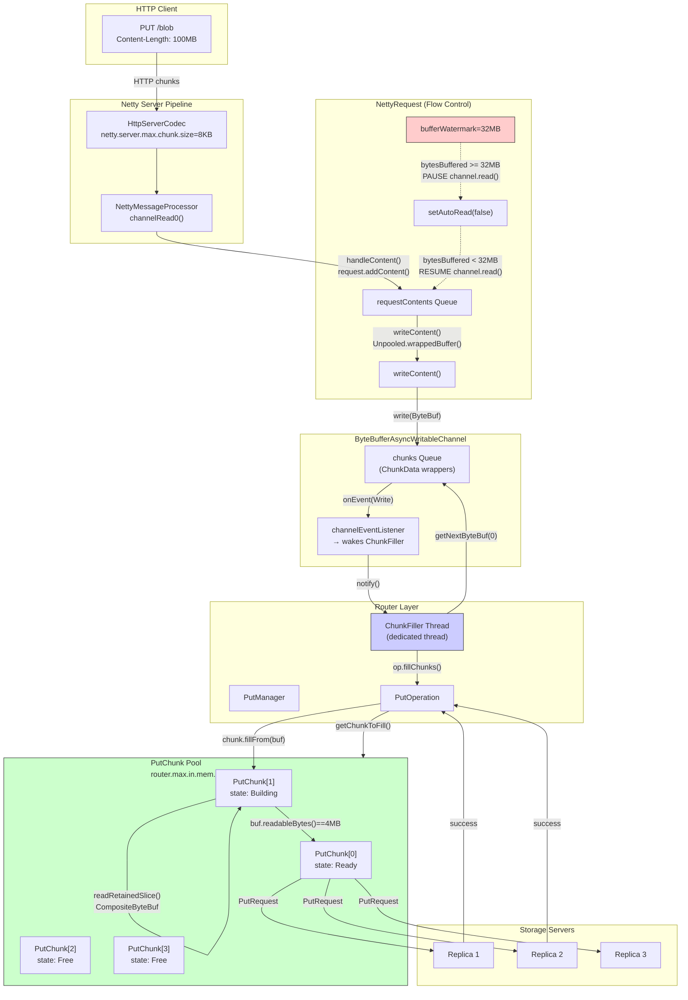
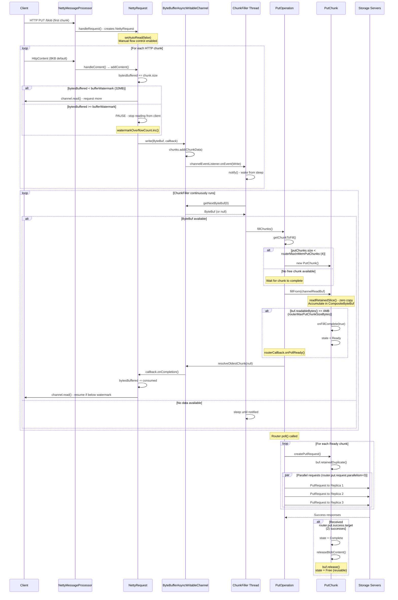

# Ambry PUT Operation Flow and Memory Configuration Analysis

## PUT Request Flow Diagram



---

## Detailed Sequence Diagram



---

## Memory Buffer Locations During PUT

### 1. Netty Layer (`NettyRequest`)

**File**: `ambry-rest/src/main/java/com/github/ambry/rest/NettyRequest.java`

```
┌─────────────────────────────────────────────────────────────────┐
│                    NettyRequest                                  │
│  ┌─────────────────────────────────────────────────────────────┐│
│  │ requestContents: Queue<HttpContent>                         ││
│  │   - Queued when writeChannel not yet set                    ││
│  │   - Each HttpContent holds ByteBuf from Netty               ││
│  │   - Reference counted (retain/release)                      ││
│  └─────────────────────────────────────────────────────────────┘│
│                                                                  │
│  bytesBuffered: AtomicLong                                      │
│    - Tracks unacknowledged bytes                                │
│    - Compared against bufferWatermark (32MB default)            │
│                                                                  │
│  Flow Control:                                                   │
│    if (bytesBuffered >= bufferWatermark) → PAUSE reading        │
│    if (bytesBuffered < bufferWatermark)  → RESUME reading       │
└─────────────────────────────────────────────────────────────────┘
```

**Config**: `netty.server.request.buffer.watermark` (default: 32 MB)

### 2. Bridge Layer (`ByteBufferAsyncWritableChannel`)

**File**: `ambry-commons/src/main/java/com/github/ambry/commons/ByteBufferAsyncWritableChannel.java`

```
┌─────────────────────────────────────────────────────────────────┐
│              ByteBufferAsyncWritableChannel                      │
│  ┌─────────────────────────────────────────────────────────────┐│
│  │ chunks: LinkedBlockingQueue<ChunkData>                      ││
│  │   - Holds ByteBuf wrappers from NettyRequest                ││
│  │   - ChunkFiller thread polls from this queue                ││
│  │   - Blocking queue (getNextByteBuf blocks if empty)         ││
│  └─────────────────────────────────────────────────────────────┘│
│                                                                  │
│  ┌─────────────────────────────────────────────────────────────┐│
│  │ chunksAwaitingResolution: LinkedBlockingDeque<ChunkData>    ││
│  │   - Chunks being consumed by PutOperation                   ││
│  │   - resolveOldestChunk() completes callback                 ││
│  └─────────────────────────────────────────────────────────────┘│
└─────────────────────────────────────────────────────────────────┘
```

**Config**: No explicit size limit - controlled by upstream watermark

### 3. Router Layer (`PutOperation` / `PutChunk`)

**File**: `ambry-router/src/main/java/com/github/ambry/router/PutOperation.java`

```
┌─────────────────────────────────────────────────────────────────┐
│                      PutOperation                                │
│  ┌─────────────────────────────────────────────────────────────┐│
│  │ putChunks: List<PutChunk>                                   ││
│  │   Max size: routerMaxInMemPutChunks (default: 4)            ││
│  │                                                              ││
│  │ ┌─────────────┐ ┌─────────────┐ ┌─────────────┐ ┌─────────┐ ││
│  │ │ PutChunk[0] │ │ PutChunk[1] │ │ PutChunk[2] │ │ Chunk[3]│ ││
│  │ │ state:Ready │ │state:Building│ │ state:Free  │ │  Free   │ ││
│  │ │ buf: 4MB    │ │ buf: 2.5MB  │ │ buf: null   │ │buf:null │ ││
│  │ └─────────────┘ └─────────────┘ └─────────────┘ └─────────┘ ││
│  └─────────────────────────────────────────────────────────────┘│
│                                                                  │
│  channelReadBuf: ByteBuf (current buffer being consumed)        │
│  bytesFilledSoFar: long (progress tracker)                      │
└─────────────────────────────────────────────────────────────────┘
```

**Configs**:
- `router.max.in.mem.put.chunks` (default: 4)
- `router.max.put.chunk.size.bytes` (default: 4 MB)
- **Max memory per operation**: 4 × 4 MB = **16 MB**

### 4. PutChunk Buffer Structure

**File**: `ambry-router/src/main/java/com/github/ambry/router/PutOperation.java:1637-1681`

```
┌─────────────────────────────────────────────────────────────────┐
│                        PutChunk.buf                              │
│                                                                  │
│  First write (buf == null):                                     │
│  ┌─────────────────────────────────────────────────────────────┐│
│  │ slice = channelReadBuf.readRetainedSlice(toWrite)           ││
│  │ buf = slice  (zero-copy reference)                          ││
│  └─────────────────────────────────────────────────────────────┘│
│                                                                  │
│  Subsequent writes:                                              │
│  ┌─────────────────────────────────────────────────────────────┐│
│  │           CompositeByteBuf (zero-copy aggregation)          ││
│  │  ┌────────┐ ┌────────┐ ┌────────┐ ┌────────┐ ┌────────┐    ││
│  │  │slice 1 │ │slice 2 │ │slice 3 │ │slice 4 │ │slice N │    ││
│  │  │ 64KB   │ │ 128KB  │ │ 256KB  │ │ 512KB  │ │  ...   │    ││
│  │  └────────┘ └────────┘ └────────┘ └────────┘ └────────┘    ││
│  │                                                              ││
│  │  Total: Up to routerMaxPutChunkSizeBytes (4MB)              ││
│  └─────────────────────────────────────────────────────────────┘│
│                                                                  │
│  When buf.readableBytes() == 4MB:                               │
│    → onFillComplete(true)                                       │
│    → state = Ready (or AwaitingBlobTypeResolution for chunk 0)  │
└─────────────────────────────────────────────────────────────────┘
```

---

## Configuration Properties Summary

### Netty Layer Configs

| Property | Default | Location | Purpose |
|----------|---------|----------|---------|
| `netty.server.request.buffer.watermark` | **32 MB** | `NettyConfig.java:121` | Backpressure threshold for incoming data |
| `netty.server.max.chunk.size` | 8 KB | `NettyConfig.java:111` | HTTP codec chunk size (not blob chunks) |
| `netty.multipart.post.max.size.bytes` | 20 MB | `NettyConfig.java:140` | Max multipart upload size |

### Router Layer Configs

| Property | Default | Location | Purpose |
|----------|---------|----------|---------|
| `router.max.put.chunk.size.bytes` | **4 MB** | `RouterConfig.java:264` | Max size of each blob chunk |
| `router.max.in.mem.put.chunks` | **4** | `RouterConfig.java:578` | Max chunks buffered per PUT operation |
| `router.put.request.parallelism` | 3 | `RouterConfig.java:271` | Parallel requests per chunk |
| `router.put.success.target` | 2 | `RouterConfig.java:285` | Required successful responses |
| `router.max.slipped.put.attempts` | 1 | `RouterConfig.java:325` | Retry attempts for failed chunks |

### HTTP/2 Configs (if enabled)

| Property | Default | Location | Purpose |
|----------|---------|----------|---------|
| `http2.initial.window.size` | 5 MB | `Http2ClientConfig.java:95` | HTTP/2 flow control window |
| `http2.frame.max.size` | 5 MB | `Http2ClientConfig.java:88` | Max HTTP/2 frame size |
| `netty.receive.buffer.size` | 1 MB | `Http2ClientConfig.java:103` | Socket receive buffer |
| `netty.send.buffer.size` | 1 MB | `Http2ClientConfig.java:111` | Socket send buffer |

---

## Memory Usage Calculation

### Per PUT Operation Maximum Memory

```
Layer                          | Buffer Size        | Notes
-------------------------------|--------------------|---------------------------------
NettyRequest (watermark)       | 32 MB              | Backpressure threshold
ByteBufferAsyncWritableChannel | Unbounded*         | *Controlled by upstream watermark
PutOperation (chunks)          | 4 × 4 MB = 16 MB   | Max in-memory chunks
-------------------------------|--------------------|---------------------------------
Total per operation            | ~48 MB             | Worst case
```

### System-Wide Memory for Concurrent PUTs

```
Total PUT Memory = (Concurrent Operations) × (Per-Operation Memory)

Example with 100 concurrent PUTs:
  Netty layer:  100 × 32 MB  = 3.2 GB (watermark-limited incoming data)
  Router layer: 100 × 16 MB  = 1.6 GB (chunk buffers)
  Total:        ~4.8 GB maximum
```

---

## Zero-Copy Patterns in PUT Path

### 1. NettyRequest → ByteBufferAsyncWritableChannel

**File**: `NettyRequest.java:494-495`
```java
// Zero-copy: retain reference, don't copy data
httpContent.retain();
writeChannel.write(httpContent.content(), new ContentWriteCallback(...));
```

### 2. ByteBufferAsyncWritableChannel → PutChunk

**File**: `PutOperation.java:1643, 1649`
```java
// Zero-copy: slice without copying underlying data
slice = channelReadBuf.readRetainedSlice(toWrite);
```

### 3. PutChunk Buffer Aggregation

**File**: `PutOperation.java:1652-1662`
```java
// Zero-copy: CompositeByteBuf aggregates without copying
if (buf instanceof CompositeByteBuf) {
    ((CompositeByteBuf) buf).addComponent(true, slice);
} else {
    CompositeByteBuf composite = buf.alloc().compositeDirectBuffer(maxComponents);
    composite.addComponents(true, buf, slice);
    buf = composite;
}
```

### 4. PutChunk → PutRequest

**File**: `PutOperation.java:1854`
```java
// Zero-copy: duplicate shares underlying buffer
buf.retainedDuplicate()
```

---

## Flow Control Mechanism

### Backpressure Chain

```
Client upload too fast
        ↓
NettyRequest.bytesBuffered >= 32MB
        ↓
channel.setAutoRead(false) ─────→ Netty stops reading from socket
        ↓
ChunkFiller consumes data
        ↓
resolveOldestChunk() called
        ↓
ContentWriteCallback.onCompletion()
        ↓
bytesBuffered -= consumed
        ↓
if (bytesBuffered < bufferWatermark)
        ↓
channel.read() ─────→ Resume reading from client
```

### Code Path for Flow Control

**1. Pause Reading** (`NettyRequest.java:572-578`):
```java
private void continueReadIfPossible(long delta) {
    if (!channel.config().isAutoRead()) {
        if (bytesBuffered.addAndGet(delta) < bufferWatermark) {
            channel.read();  // Resume
        } else {
            nettyMetrics.watermarkOverflowCount.inc();  // Stay paused
        }
    }
}
```

**2. Resume After Consumption** (`NettyRequest.java:619`):
```java
// In ContentWriteCallback.onCompletion():
continueReadIfPossible(-result);  // Negative delta = bytes consumed
```

---

## Chunk Lifecycle States

**File**: `PutOperation.java:2421-2447`

```
┌────────┐    fillFrom()     ┌──────────┐
│  Free  │ ───────────────→  │ Building │
└────────┘                   └──────────┘
     ↑                            │
     │                            │ buf full (4MB)
     │                            ↓
     │                   ┌────────────────────────┐
     │                   │AwaitingBlobTypeResolution│  (first chunk only)
     │                   └────────────────────────┘
     │                            │
     │                            │ onFillComplete()
     │                            ↓
     │                       ┌─────────┐
     │                       │Encrypting│  (if encryption enabled)
     │                       └─────────┘
     │                            │
     │                            ↓
     │ releaseBlobContent()  ┌───────┐
     │ ←──────────────────── │ Ready │
     │                       └───────┘
     │                            │
     │                            │ PutRequest sent to replicas
     │                            ↓
     │                      ┌──────────┐
     └───────────────────── │ Complete │
          reuse chunk       └──────────┘
```

---

## How maxOrder Interacts with PUT Operations

Since PUT operations use `PooledByteBufAllocator.DEFAULT` in several places:

### Allocation Points

1. **PutRequest header** (`PutRequest.java:240`):
   ```java
   bufferToSend = PooledByteBufAllocator.DEFAULT.ioBuffer(sizeExcludingBlobAndCrcSize());
   ```
   - Small allocations (~1KB headers)
   - Always within pooled range

2. **Chunk data** - uses zero-copy slicing, NOT new allocations:
   ```java
   slice = channelReadBuf.readRetainedSlice(toWrite);  // No allocation!
   ```

3. **CompositeByteBuf** - aggregates without large allocations:
   ```java
   buf.alloc().compositeDirectBuffer(maxComponents);  // Just metadata
   ```

### Impact Analysis

| maxOrder | Max Pooled | PUT Impact |
|----------|------------|------------|
| 9 (4MB)  | 4 MB       | Chunk data comes from Netty's buffers, not new allocations. Headers always fit. |
| 11 (16MB)| 16 MB      | Same as above - PUT uses zero-copy patterns |

**Key Insight**: PUT operations are less sensitive to `maxOrder` than GET operations because:
- Incoming data uses Netty's pre-allocated receive buffers
- `readRetainedSlice()` creates views, not copies
- `CompositeByteBuf` aggregates without allocating data buffers
- Only small headers are explicitly allocated

---

## Tuning Recommendations

### For High-Throughput PUT Workloads

```properties
# Increase watermark if clients upload faster than storage can accept
netty.server.request.buffer.watermark=67108864  # 64 MB

# Increase in-memory chunks for better pipelining
router.max.in.mem.put.chunks=8

# Increase parallelism for faster replication
router.put.request.parallelism=4
```

### For Memory-Constrained Environments

```properties
# Reduce watermark to limit incoming buffer
netty.server.request.buffer.watermark=16777216  # 16 MB

# Reduce chunk pool size
router.max.in.mem.put.chunks=2

# Reduce chunk size (will create more chunks per blob)
router.max.put.chunk.size.bytes=2097152  # 2 MB
```

### Memory Formula

```
Max Memory Per Operation =
    netty.server.request.buffer.watermark +
    (router.max.in.mem.put.chunks × router.max.put.chunk.size.bytes)

Default: 32 MB + (4 × 4 MB) = 48 MB per PUT operation
```
