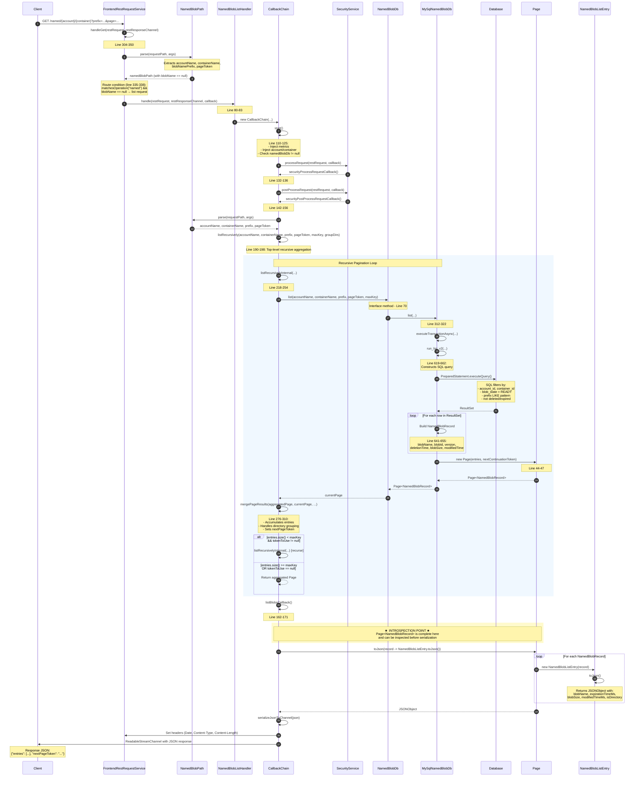

# List Blob Request Flow

This document details the class/method path from the HTTP router through service logic for a list blob request in Ambry.

## Mermaid Sequence Diagram



## Class/Method Reference Table

| Step | File | Class | Method | Line |
|------|------|-------|--------|------|
| 1 | `ambry-frontend/.../FrontendRestRequestService.java` | `FrontendRestRequestService` | `handleGet()` | 304 |
| 2 | `ambry-api/.../frontend/NamedBlobPath.java` | `NamedBlobPath` | `parse()` | 54 |
| 3 | `ambry-frontend/.../NamedBlobListHandler.java` | `NamedBlobListHandler` | `handle()` | 80 |
| 4 | `ambry-frontend/.../NamedBlobListHandler.java` | `CallbackChain` | `start()` | 110 |
| 5 | `ambry-frontend/.../NamedBlobListHandler.java` | `CallbackChain` | `securityProcessRequestCallback()` | 132 |
| 6 | `ambry-frontend/.../NamedBlobListHandler.java` | `CallbackChain` | `securityPostProcessRequestCallback()` | 142 |
| 7 | `ambry-frontend/.../NamedBlobListHandler.java` | `CallbackChain` | `listRecursively()` | 190 |
| 8 | `ambry-frontend/.../NamedBlobListHandler.java` | `CallbackChain` | `listRecursivelyInternal()` | 218 |
| 9 | `ambry-api/.../named/NamedBlobDb.java` | `NamedBlobDb` | `list()` | 70 |
| 10 | `ambry-named-mysql/.../MySqlNamedBlobDb.java` | `MySqlNamedBlobDb` | `list()` | 312 |
| 11 | `ambry-named-mysql/.../MySqlNamedBlobDb.java` | `MySqlNamedBlobDb` | `run_list_v2()` | 619 |
| 12 | `ambry-frontend/.../NamedBlobListHandler.java` | `CallbackChain` | `mergePageResults()` | 276 |
| 13 | `ambry-frontend/.../NamedBlobListHandler.java` | `CallbackChain` | `listBlobsCallback()` | 162 |
| 14 | `ambry-api/.../frontend/Page.java` | `Page<T>` | `toJson()` | 68 |
| 15 | `ambry-api/.../frontend/NamedBlobListEntry.java` | `NamedBlobListEntry` | `toJson()` | ~106 |

## Detailed Flow Description

### 1. HTTP Entry Point (`FrontendRestRequestService.handleGet()`)

```java
// Line 335-338 in FrontendRestRequestService.java
} else if (requestPath.matchesOperation(Operations.NAMED_BLOB)
    && NamedBlobPath.parse(requestPath, restRequest.getArgs()).getBlobName() == null) {
  namedBlobListHandler.handle(restRequest, restResponseChannel, callback);
}
```

The routing logic checks:
- Request matches `/named/...` operation
- `blobName` is `null` (indicating a list request, not a single blob fetch)

### 2. Handler Initialization (`NamedBlobListHandler.handle()`)

```java
// Line 80-83
public void handle(RestRequest restRequest, RestResponseChannel restResponseChannel,
    Callback<ReadableStreamChannel> callback) {
  new CallbackChain(restRequest, restResponseChannel, callback).start();
}
```

### 3. Callback Chain Execution

The `CallbackChain` inner class orchestrates the async processing:

1. **`start()`** (line 110): Initializes metrics, injects account/container, validates namedBlobDb
2. **`securityProcessRequestCallback()`** (line 132): Pre-processes security
3. **`securityPostProcessRequestCallback()`** (line 142): Post-processes security, then initiates listing

### 4. Recursive List Aggregation (`listRecursively()`)

```java
// Line 190-198
public CompletableFuture<Page<NamedBlobRecord>> listRecursively(
    String accountName, String containerName, String blobNamePrefix,
    String pageToken, Integer maxKey, boolean groupDirectories) {

  Page<NamedBlobRecord> initialAggregatedPage = new Page<>(new ArrayList<>(), null);
  return listRecursivelyInternal(...).thenApply(
      finalPage -> new Page<>(finalPage.getEntries(), finalPage.getNextPageToken()));
}
```

This recursively fetches and merges pages until:
- `maxKey` entries are accumulated, OR
- No more pages exist (`nextPageToken == null`)

### 5. Database Query (`MySqlNamedBlobDb.run_list_v2()`)

```java
// Line 619-662
private Page<NamedBlobRecord> run_list_v2(...) {
  // Constructs SQL query with filters:
  // - account_id, container_id
  // - blob_state = READY
  // - blob_name LIKE prefix%
  // - (deleted_ts IS NULL OR deleted_ts > NOW())

  ResultSet resultSet = statement.executeQuery();
  List<NamedBlobRecord> entries = new ArrayList<>();
  while (resultSet.next()) {
    // Build NamedBlobRecord from each row
    entries.add(new NamedBlobRecord(...));
  }
  return new Page<>(entries, nextContinuationToken);
}
```

### 6. Response Serialization (`listBlobsCallback()`)

```java
// Line 162-171
private Callback<Page<NamedBlobRecord>> listBlobsCallback() {
  return buildCallback(frontendMetrics.listDbLookupMetrics, page -> {
    ReadableStreamChannel channel = serializeJsonToChannel(
        page.toJson(record -> new NamedBlobListEntry(record).toJson())
    );
    // Set response headers and return
    finalCallback.onCompletion(channel, null);
  }, uri, LOGGER, finalCallback);
}
```

---

## Introspection Point

The **complete list is available for introspection** at the following point:

### Location: `NamedBlobListHandler.java`, line 163

```java
private Callback<Page<NamedBlobRecord>> listBlobsCallback() {
  return buildCallback(frontendMetrics.listDbLookupMetrics, page -> {
    // ★ INTROSPECTION POINT ★
    // The 'page' parameter contains the complete Page<NamedBlobRecord>
    // with all aggregated entries from the recursive listing.

    // At this point you can:
    // 1. Inspect page.getEntries() - List<NamedBlobRecord>
    // 2. Verify the list contents
    // 3. Check page.getNextPageToken() for pagination state

    ReadableStreamChannel channel = serializeJsonToChannel(
        page.toJson(record -> new NamedBlobListEntry(record).toJson())
    );
    ...
  }, uri, LOGGER, finalCallback);
}
```

### What's Available at Introspection Point

The `Page<NamedBlobRecord>` object contains:

| Field | Type | Description |
|-------|------|-------------|
| `entries` | `List<NamedBlobRecord>` | Complete list of blob records |
| `nextPageToken` | `String` | `null` if complete, or token for next page |

Each `NamedBlobRecord` contains:

| Field | Type | Description |
|-------|------|-------------|
| `accountName` | `String` | Account name |
| `containerName` | `String` | Container name |
| `blobName` | `String` | Full blob name/path |
| `blobId` | `String` | Ambry blob ID (Base64 encoded) |
| `expirationTimeMs` | `long` | Expiration timestamp (-1 for infinite) |
| `version` | `long` | Version number |
| `blobSize` | `long` | Size in bytes |
| `modifiedTimeMs` | `long` | Last modified timestamp |
| `isDirectory` | `boolean` | Whether this is a virtual directory |

### Alternative Introspection Points

1. **After `listRecursively()` completes** (line 150-154): The `CompletableFuture<Page<NamedBlobRecord>>` resolves with the complete page.

2. **Inside `mergePageResults()`** (line 276-310): Observe the accumulation process and intermediate states.

3. **After `run_list_v2()`** (line 656): Each individual database page before aggregation.

---

## Response JSON Structure

```json
{
  "entries": [
    {
      "blobName": "path/to/file.txt",
      "expirationTimeMs": -1,
      "blobSize": 1024,
      "modifiedTimeMs": 1701625600000,
      "isDirectory": false
    },
    {
      "blobName": "path/to/folder/",
      "expirationTimeMs": -1,
      "blobSize": 0,
      "modifiedTimeMs": 0,
      "isDirectory": true
    }
  ],
  "nextPageToken": "path/to/next/blob"
}
```

Where `nextPageToken` is `null` if no more pages exist.
