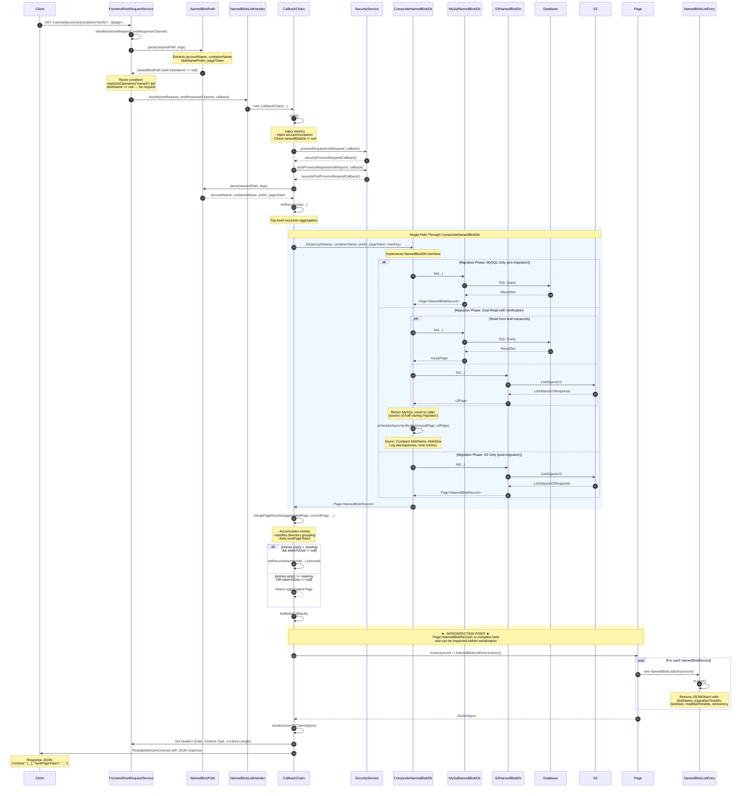

# List Blob Request Flow

This document details the class/method path from the HTTP router through service logic for a list blob request in Ambry.

## Architecture Overview

All list requests flow through a **single path** to a `CompositeNamedBlobDb`. The composite internally decides whether to read from MySQL, S3, or both based on the migration phase. This design ensures:
- Consistent API behavior regardless of backend
- Centralized migration logic
- Async verification without external coordination

```
┌─────────────────────────────────────────────────────────────────────┐
│                        API Layer                                     │
│  FrontendRestRequestService → NamedBlobListHandler → CallbackChain  │
└─────────────────────────────────┬───────────────────────────────────┘
                                  │
                                  ▼
┌─────────────────────────────────────────────────────────────────────┐
│                     NamedBlobDb Interface                            │
│                              │                                       │
│                              ▼                                       │
│                   CompositeNamedBlobDb                               │
│         ┌────────────────────┼────────────────────┐                 │
│         │                    │                    │                 │
│         ▼                    ▼                    ▼                 │
│   MySqlNamedBlobDb    S3NamedBlobDb    VerificationService          │
│         │                    │                    │                 │
│         ▼                    ▼                    │                 │
│      MySQL DB            S3 Bucket         (async comparison)       │
└─────────────────────────────────────────────────────────────────────┘
```

## Mermaid Sequence Diagram



## CompositeNamedBlobDb Architecture

The `CompositeNamedBlobDb` is the **central component** that implements the `NamedBlobDb` interface and encapsulates all migration logic.

### Responsibilities

| Responsibility | Description |
|---------------|-------------|
| Backend Selection | Decides which backend(s) to query based on migration phase configuration |
| Result Routing | Returns results from the appropriate backend (MySQL during migration, S3 after) |
| Async Verification | Schedules background comparison of MySQL vs S3 results |
| Metric Emission | Tracks latency, discrepancies, and verification results |

### Migration Phases

```
┌──────────────────┐    ┌──────────────────┐    ┌──────────────────┐
│  Phase 1: MySQL  │───▶│ Phase 2: Dual    │───▶│  Phase 3: S3     │
│     Only         │    │ Read + Verify    │    │     Only         │
└──────────────────┘    └──────────────────┘    └──────────────────┘
       │                        │                        │
       ▼                        ▼                        ▼
  Read: MySQL             Read: Both               Read: S3
  Return: MySQL           Return: MySQL            Return: S3
  Verify: None            Verify: Async            Verify: None
```

### Verification Strategy

During Phase 2 (Dual Read), the composite performs async verification:

1. **Time-based sampling**: Verify at most N requests per time period
2. **Field comparison**: Compare only `blobName` and `blobSize`
3. **Non-blocking**: Verification runs in background thread
4. **Metrics**: Emit counters for matches/mismatches

## Class/Method Reference Table

| Step | Class | Method | Description |
|------|-------|--------|-------------|
| 1 | `FrontendRestRequestService` | `handleGet()` | HTTP entry point |
| 2 | `NamedBlobPath` | `parse()` | Extract request parameters |
| 3 | `NamedBlobListHandler` | `handle()` | Handler invocation |
| 4 | `CallbackChain` | `start()` | Initialize async chain |
| 5 | `CallbackChain` | `securityProcessRequestCallback()` | Security pre-processing |
| 6 | `CallbackChain` | `securityPostProcessRequestCallback()` | Security post-processing |
| 7 | `CallbackChain` | `listRecursively()` | Start recursive aggregation |
| 8 | `CompositeNamedBlobDb` | `list()` | **Single entry point** - routes to backend(s) |
| 9 | `MySqlNamedBlobDb` | `list()` | MySQL implementation |
| 10 | `S3NamedBlobDb` | `list()` | S3 implementation |
| 11 | `CompositeNamedBlobDb` | `scheduleAsyncVerification()` | Background comparison |
| 12 | `CallbackChain` | `mergePageResults()` | Aggregate pages |
| 13 | `CallbackChain` | `listBlobsCallback()` | Serialize response |
| 14 | `Page<T>` | `toJson()` | Convert to JSON |
| 15 | `NamedBlobListEntry` | `toJson()` | Entry serialization |

## Detailed Flow Description

### 1. HTTP Entry Point (`FrontendRestRequestService.handleGet()`)

The routing logic checks:
- Request matches `/named/...` operation
- `blobName` is `null` (indicating a list request, not a single blob fetch)

```java
} else if (requestPath.matchesOperation(Operations.NAMED_BLOB)
    && NamedBlobPath.parse(requestPath, restRequest.getArgs()).getBlobName() == null) {
  namedBlobListHandler.handle(restRequest, restResponseChannel, callback);
}
```

### 2. Handler Initialization (`NamedBlobListHandler.handle()`)

```java
public void handle(RestRequest restRequest, RestResponseChannel restResponseChannel,
    Callback<ReadableStreamChannel> callback) {
  new CallbackChain(restRequest, restResponseChannel, callback).start();
}
```

### 3. Callback Chain Execution

The `CallbackChain` inner class orchestrates the async processing:

1. **`start()`**: Initializes metrics, injects account/container, validates namedBlobDb
2. **`securityProcessRequestCallback()`**: Pre-processes security
3. **`securityPostProcessRequestCallback()`**: Post-processes security, then initiates listing

### 4. CompositeNamedBlobDb.list()

The composite is the **single implementation** of `NamedBlobDb` injected into the handler. It encapsulates all backend routing:

```java
public class CompositeNamedBlobDb implements NamedBlobDb {
    private final MySqlNamedBlobDb mysqlDb;
    private final S3NamedBlobDb s3Db;
    private final MigrationPhase phase;
    private final VerificationService verificationService;

    @Override
    public CompletableFuture<Page<NamedBlobRecord>> list(
            String accountName, String containerName,
            String blobNamePrefix, String pageToken, Integer maxKeys) {

        switch (phase) {
            case MYSQL_ONLY:
                return mysqlDb.list(accountName, containerName, blobNamePrefix, pageToken, maxKeys);

            case DUAL_READ_VERIFY:
                CompletableFuture<Page<NamedBlobRecord>> mysqlFuture =
                    mysqlDb.list(accountName, containerName, blobNamePrefix, pageToken, maxKeys);
                CompletableFuture<Page<NamedBlobRecord>> s3Future =
                    s3Db.list(accountName, containerName, blobNamePrefix, pageToken, maxKeys);

                return mysqlFuture.thenCompose(mysqlPage -> {
                    s3Future.thenAccept(s3Page ->
                        verificationService.scheduleAsyncVerification(mysqlPage, s3Page));
                    return CompletableFuture.completedFuture(mysqlPage);
                });

            case S3_ONLY:
                return s3Db.list(accountName, containerName, blobNamePrefix, pageToken, maxKeys);
        }
    }
}
```

### 5. Backend Implementations

#### MySqlNamedBlobDb.list()

Queries MySQL with filters:
- `account_id`, `container_id`
- `blob_state = READY`
- `blob_name LIKE prefix%`
- `(deleted_ts IS NULL OR deleted_ts > NOW())`

#### S3NamedBlobDb.list()

Calls S3 ListObjectsV2:
- Uses prefix: `{accountId}/{containerId}/{blobNamePrefix}`
- Returns all objects (no metadata filtering possible)
- See [S3 Named Blob DB Specification](s3-named-blob-db-list-specification.md) for behavioral differences

### 6. Recursive Aggregation (`listRecursively()`)

```java
public CompletableFuture<Page<NamedBlobRecord>> listRecursively(
    String accountName, String containerName, String blobNamePrefix,
    String pageToken, Integer maxKey, boolean groupDirectories) {

  Page<NamedBlobRecord> initialAggregatedPage = new Page<>(new ArrayList<>(), null);
  return listRecursivelyInternal(...).thenApply(
      finalPage -> new Page<>(finalPage.getEntries(), finalPage.getNextPageToken()));
}
```

This recursively fetches and merges pages until:
- `maxKey` entries are accumulated, OR
- No more pages exist (`nextPageToken == null`)

### 7. Response Serialization (`listBlobsCallback()`)

```java
private Callback<Page<NamedBlobRecord>> listBlobsCallback() {
  return buildCallback(frontendMetrics.listDbLookupMetrics, page -> {
    ReadableStreamChannel channel = serializeJsonToChannel(
        page.toJson(record -> new NamedBlobListEntry(record).toJson())
    );
    finalCallback.onCompletion(channel, null);
  }, uri, LOGGER, finalCallback);
}
```

---

## Introspection Point

The **complete list is available for introspection** at the following point:

### Location: `NamedBlobListHandler.java`, in `listBlobsCallback()`

```java
private Callback<Page<NamedBlobRecord>> listBlobsCallback() {
  return buildCallback(frontendMetrics.listDbLookupMetrics, page -> {
    // ★ INTROSPECTION POINT ★
    // The 'page' parameter contains the complete Page<NamedBlobRecord>
    // with all aggregated entries from the recursive listing.

    // At this point you can:
    // 1. Inspect page.getEntries() - List<NamedBlobRecord>
    // 2. Verify the list contents
    // 3. Check page.getNextPageToken() for pagination state

    ReadableStreamChannel channel = serializeJsonToChannel(
        page.toJson(record -> new NamedBlobListEntry(record).toJson())
    );
    ...
  }, uri, LOGGER, finalCallback);
}
```

### What's Available at Introspection Point

The `Page<NamedBlobRecord>` object contains:

| Field | Type | Description |
|-------|------|-------------|
| `entries` | `List<NamedBlobRecord>` | Complete list of blob records |
| `nextPageToken` | `String` | `null` if complete, or token for next page |

Each `NamedBlobRecord` contains:

| Field | Type | Description |
|-------|------|-------------|
| `accountName` | `String` | Account name |
| `containerName` | `String` | Container name |
| `blobName` | `String` | Full blob name/path |
| `blobId` | `String` | Ambry blob ID (Base64 encoded) |
| `expirationTimeMs` | `long` | Expiration timestamp (-1 for infinite) |
| `version` | `long` | Version number |
| `blobSize` | `long` | Size in bytes |
| `modifiedTimeMs` | `long` | Last modified timestamp |
| `isDirectory` | `boolean` | Whether this is a virtual directory |

### Alternative Introspection Points

1. **Inside `CompositeNamedBlobDb.list()`**: Observe backend selection and verification scheduling
2. **After `listRecursively()` completes**: The `CompletableFuture<Page<NamedBlobRecord>>` resolves with the complete page
3. **Inside `mergePageResults()`**: Observe the accumulation process and intermediate states

---

## Response JSON Structure

```json
{
  "entries": [
    {
      "blobName": "path/to/file.txt",
      "expirationTimeMs": -1,
      "blobSize": 1024,
      "modifiedTimeMs": 1701625600000,
      "isDirectory": false
    },
    {
      "blobName": "path/to/folder/",
      "expirationTimeMs": -1,
      "blobSize": 0,
      "modifiedTimeMs": 0,
      "isDirectory": true
    }
  ],
  "nextPageToken": "path/to/next/blob"
}
```

Where `nextPageToken` is `null` if no more pages exist.

---

## Related Documentation

- [S3 Named Blob DB List Specification](s3-named-blob-db-list-specification.md) - Detailed spec for S3 implementation
- [Ambry Named Blob Architecture Guide](ambry-named-blob-architecture-guide.md) - System architecture overview
